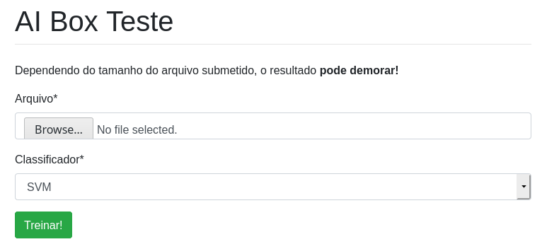
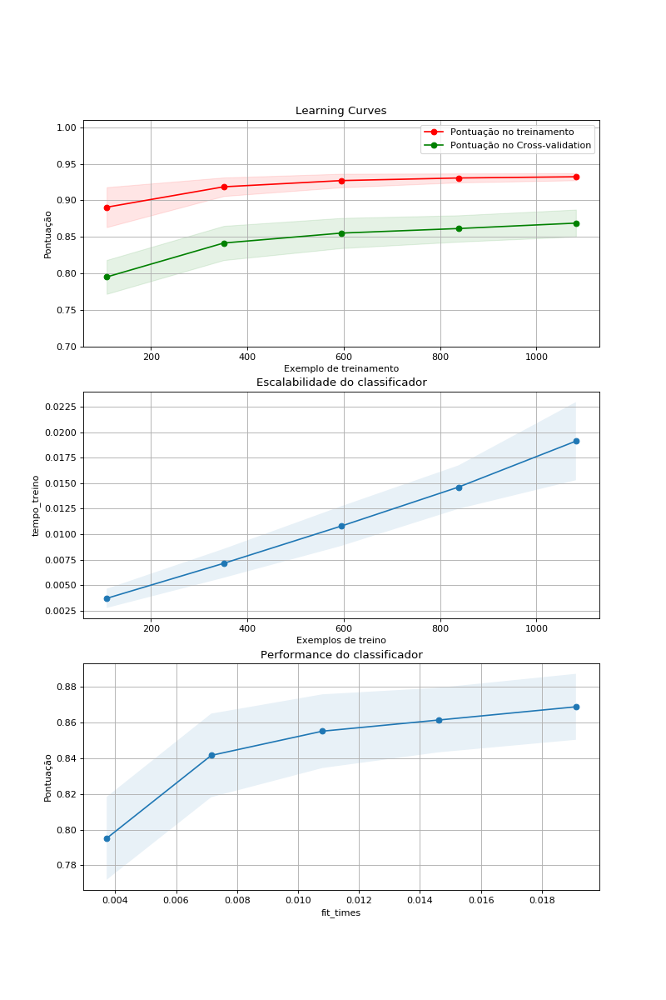

# aibox-teste
# correct_orientation

Esse projeto consiste de uma página web que tem a finalidade de a partir de um dataset e de um classificador, fornecer ao usuário as seguintes informações: curva de aprendizado, escalabilidade e performance.

Como pode ser observado na figura a baixo.

## Como rodar esse projeto?

* Utilizando o Poetry:
  
  1. [Instale o Poetry](https://python-poetry.org/docs/#installation)
  2. Dentro do diretório `aibox-teste/` onde está localizado o arquivo `pyproject.toml`, execute:
      
      `$ poetry install`

* Utilizando o requirements.txt:
  
  1. Crie um envirement utilizando [pyenv](https://github.com/pyenv/pyenv), [miniconda](https://docs.conda.io/en/latest/miniconda.html) ou outro gerenciador de envirement que você preferir.
  2. Com o envirement ativado, execute:
      
      `$ pip install -r requirements.txt`

* Após a instalação:
  
  1. Dentro do diretório `/aiboxteste/`, execute:
      
       `$ python manage.py runserver`
 
  2. Acesse no seu browser favorito:
        
        http://localhost:8000/
  
  3. Na página, terá um campo de anexar arquivo. Selecione o arquivo presente no diretório `aiboxteste/media/`
